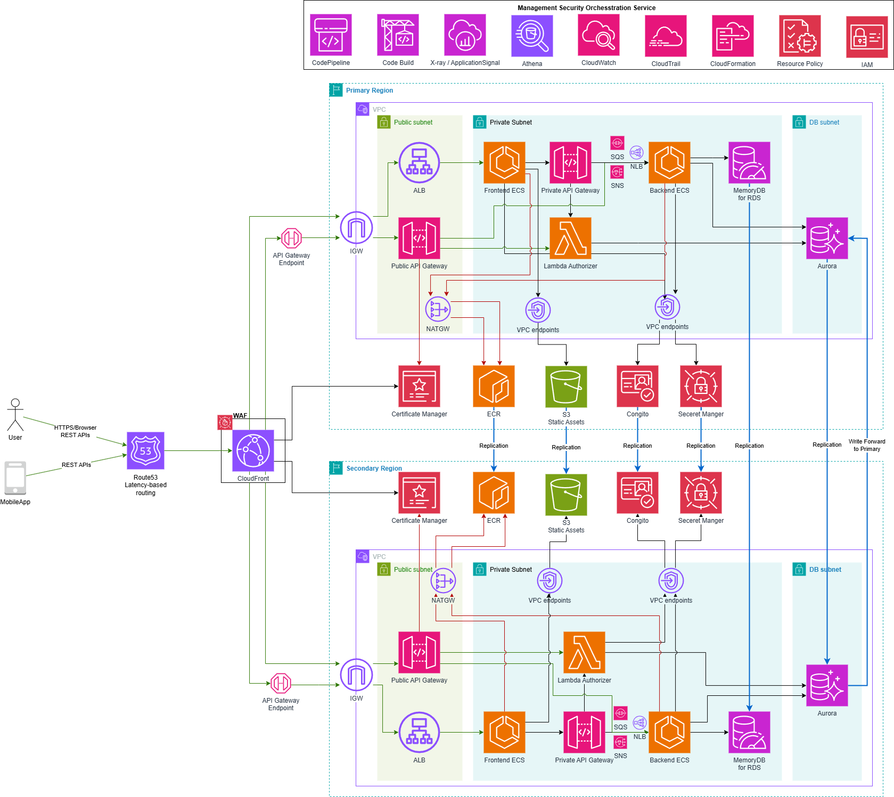

# Solution Overview
This solution is designed as a highly available, low-latency trading system inspired by platforms such as Binance. It operates in an **active-active** configuration across two AWS Regions, ensuring minimal downtime and rapid failover in the event of a regional disruption. By distributing the workload across multiple Availability Zones (AZs) in each region and leveraging AWS global services, the system maintains a p99 response time below 100 ms, while supporting a throughput of 500 requests per second.

---

## 1. Architecture at a Glance
**Architecture Diagram**

1. **Global Services**  
   - **Amazon Route 53** for DNS-based traffic routing (latency or weighted routing).  
   - **Amazon CloudFront** as the Content Delivery Network (CDN) for static assets and edge caching.  
   - **AWS WAF** to protect against common web exploits and provide additional security controls at the edge.  
   - **AWS Certificate Manager (ACM)** for SSL/TLS certificate provisioning and management.

2. **Regional Services**  
   Each region hosts a mirrored stack to enable active-active functionality:  
   - **Amazon API Gateway** with a **Lambda Authorizer** (or Amazon Cognito) for authentication and authorization.  
   - **Application Load Balancer (ALB)** to distribute traffic across containers or serverless functions.  
   - **AWS Fargate** (under Amazon ECS) for compute.  
   - **Amazon Aurora (MySQL or PostgreSQL) with Multi-AZ** for transactional and NoSQL data, respectively.  
   - **Amazon MemoryDB (Redis)** for low-latency caching.  
   - **AWS Secrets Manager** for secure handling of credentials.  
   - **Amazon S3** for storing static content and application artifacts (with cross-region replication if needed).

3. **Observability and Management**  
   - **Amazon CloudWatch** for metrics, logs, and alarms.  
   - **AWS X-Ray** for distributed tracing and performance analysis.  
   - **AWS CloudTrail** for auditing API calls.  
   - **AWS CodePipeline**, **CodeBuild**, and **CodeDeploy** for CI/CD.

4. **Network Architecture**  
   - **VPC** with public and private subnets in multiple AZs.  
   - **NAT Gateways** to allow outbound internet access for private subnets.  
   - **Security Groups** and **Network ACLs** for controlled inbound and outbound traffic.

---

## 2. Data Flow

1. **Client Requests**  
    - Client makes an HTTPS request to the example.com domain. Route 53 resolves the domain.
    - Client makes the request to the closest CloudFront Points of Presence (PoP) location to the client.
    - CloudFront speeds up the distribution of your content by routing each request through the AWS global network to the edge location that can best serve your content. Typically, this is a CloudFront edge server that provides the fastest delivery to the viewer.
    - CloudFront PoP location makes a DNS request to Route 53 to resolve the origin domain name example.com. Since this domain name has the latency-based routing policy configured in Route 53, the IP addresses are returned of the API Gateway in the closest Region to the CloudFront PoP location.
    - CloudFront PoP location makes HTTP request to the API Gateway to the appropriate origin (APIGW/ALB) in the closest Region.
    - Users connect to the trading application through Route 53, which uses latency-based routing to direct them to the region with the lowest latency.

2. **Edge and Security**  
   Requests pass through CloudFront and AWS WAF for caching static content and applying security rules. SSL/TLS termination happens at CloudFront and the ALB, with certificates managed by ACM.

3. **Application Entry**  
   CloudFront forwards requests to an **API Gateway** endpoint in the chosen region. The API Gateway uses a **Lambda Authorizer** and **Amazon Cognito** to validate user tokens and permissions.

4. **Compute Layer**  
   Authenticated requests are routed to **AWS Fargate** containers (via an ALB)

5. **Database and Persistence**  
   - **Aurora (MySQL/PostgreSQL) Multi-AZ** store core trading data.  
   - **MemoryDB (Redis)** provides low-latency caching for session data, frequently accessed market data, and ephemeral states.  
   - **Amazon S3** stores static assets, logs, and other unstructured data.

6. **Response**  
   The response is returned to the user through the same path in reverse order, ensuring consistent performance and security checks.

---

## 3. High Availability Strategy

- **Active-Active Across Regions**: Each region runs the full stack, ready to serve traffic at all times. This eliminates single-region dependency and reduces failover times significantly.  
- **Multi-AZ Deployments**: Within each region, critical services such as Aurora and ECS tasks are spread across multiple Availability Zones.  
- **Load Balancing & Auto Scaling**: ALBs distribute incoming requests evenly, while Auto Scaling (for ECS tasks or Lambda concurrency) adjusts capacity based on real-time traffic and performance metrics.  
- **Cross-Region Replication**:  
  - **Aurora Global Database** ensure data is replicated and kept consistent across regions.  
  - **S3 Cross-Region Replication** can be configured for important data that must be available in both regions.

---

## 4. Performance and Low Latency Considerations

- **Latency-Based Routing**: Route 53 directs clients to the closest region in terms of network latency, reducing round-trip times.  
- **Caching Layers**:  
  - **CloudFront** caches static assets at edge locations.  
  - **MemoryDB (Redis)** handles frequently accessed data to minimize database reads.  
- **Containerized Compute**: ECS Fargate can scale quickly to handle spikes in traffic.  
- **p99 < 100 ms**: By reducing network hops, optimizing queries, and leveraging in-memory caches, the architecture is designed to closely reach the 100 ms p99 response time target.

---

## 5. Scalability Approach

- **ECS/Fargate Auto Scaling**: Horizontal scaling of containers based on CPU/memory usage, queue length (if using SQS), or custom CloudWatch metrics.  
- **Lambda Concurrency**: Lambda functions scale automatically based on concurrent requests, ensuring sudden surges are handled smoothly.  
- **Aurora Autoscaling**: Aurora’s serverless or provisioned autoscaling features can be used to handle peak workloads.  
- **DynamoDB On-Demand or Provisioned Capacity**: DynamoDB automatically scales to meet traffic demands, or use provisioned capacity with auto scaling for more predictable workloads.  
- **Sharding and Partitioning**: For very large datasets, partitioning in Aurora or using advanced sharding patterns can be introduced to keep query performance high.

---

## 6. Security and Compliance

- **Network Segregation**: Private subnets host databases and application services, while public subnets only expose load balancers or NAT Gateways.  
- **Encryption**:  
  - **TLS** in transit using ACM-managed certificates.  
  - **KMS**-backed encryption at rest for S3, Aurora.
- **Secrets Management**: **AWS Secrets Manager** stores and rotates database credentials and other sensitive information.  
- **AWS WAF & Security Groups**: Fine-grained rules to block malicious traffic and allow only necessary ports/protocols.  
- **Monitoring and Audit**:  
  - **CloudTrail** logs API actions for auditing.  
  - **CloudWatch** and **X-Ray** provide monitoring, alerting, and distributed tracing.

---

## 7. Deployment and CI/CD

- **AWS CodePipeline** orchestrates the build-test-deploy steps.  
- **AWS CodeBuild** runs unit tests, integration tests, and security scans.  
- **AWS CodeDeploy** or Blue/Green deployments for ECS/Lambda to minimize downtime and reduce deployment risk.  
- **Infrastructure as Code (IaC)**: AWS CloudFormation or AWS CDK templates ensure consistent, repeatable deployments across regions.

---

## 8. Future Growth and Evolution

- **Additional Regions**: The active-active pattern can be extended to more AWS regions for an even more global presence and improved latency.  
- **Microservices**: As new features are added, they can be deployed as separate microservices behind the API Gateway, scaling independently.  
- **Event-Driven Patterns**: Introducing Amazon Kinesis for asynchronous event processing can improve system responsiveness and decouple services further.  
- **Analytics and Machine Learning**: Historical trade data can be offloaded to Amazon S3 or Amazon Redshift for analytics. AWS Machine Learning services can be used to build advanced trading algorithms or fraud detection.

---

## Conclusion
This active-active, multi-region AWS architecture ensures high availability, low latency, and cost-effective scalability for a trading platform similar to Binance. By leveraging managed services, in-memory caching, and distributed data stores, the system trying to reach the p99 response time requirement of under 100 ms while handling 500 requests per second. The solution also allows for seamless future expansion, both in terms of features and geographic coverage.
